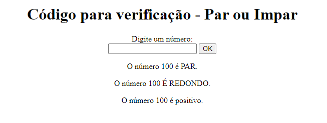

# 🔍 Atividades

## 📋 descrição
- feito para aula de programação web II, os três arquivos apresenta uma caixa de pergunta, depois que o usuario diz um numero ele mostra uma informação.  
    [A atividade](https://github.com/emillycaaroline/Atividades/blob/main/atv1.php), `ele mostra se o numero escolhido pelo usuario é impar ou par, se é redondo ou não e se é positivo, negativo ou neutro. ` 

    O código em [CSS](https://github.com/emillycaaroline/Atividades/blob/main/style.css) `Só serve para colocar o texto no centro`
   
## 🔧 Funcionalidades

- Ajudar com calculos matemáticos

### 🛠️ Tecnologias Utilizadas
    
   - github  
   - HTML5 
   - PHP  
   - CSS

## 🖇️ Fontes consultadas
- Usei um [site](https://www.php.net/manual/pt_BR/tutorial.forms.php) onde descobri o POST.
- Utilizei tambem como fonte de pesuisa outros codigos feitos em sala, onde consegui pega inpiração.

## Tela

## ✒️ Autor

[ Emilly Caroline ](https://github.com/emillycaaroline)   

Ajuda:  
[ Leonardo Rocha ](https://github.com/LeonardoRochaMarista)  
